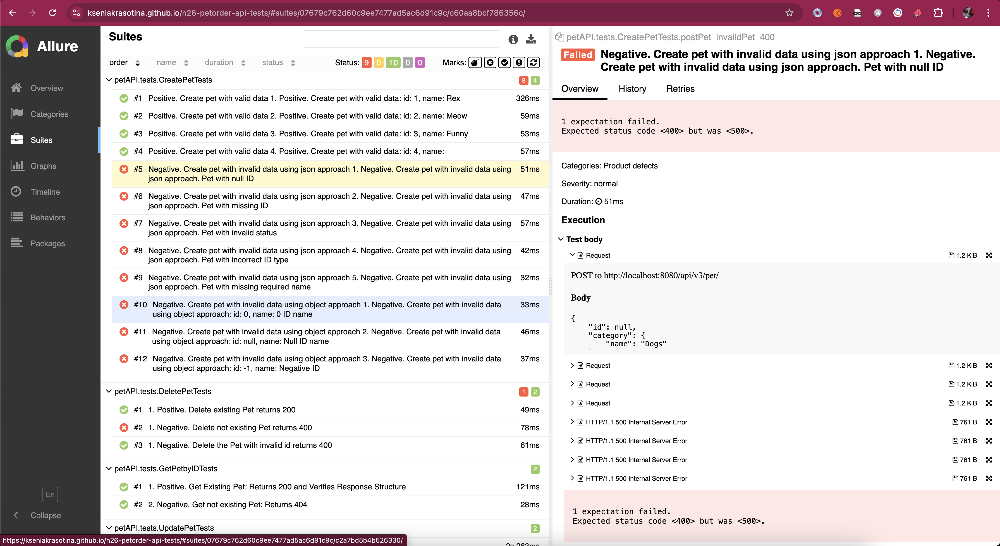

# Solution Explanation

## Setup

Please follow these steps to set up the project on your local machine:

1. **Clone the repository:**
   ```bash
   git clone KseniaKrasotina/n26-petorder-api-tests
   cd n26-petorder-api-tests
   ```

2. **Install dependencies:**
   Ensure you have [Java JDK](https://www.oracle.com/java/technologies/javase-downloads.html) and [Maven](https://maven.apache.org/) installed. Then, run:
   ```bash
   mvn clean install
   ```

3. **Allure installation:**
   Install Allure locally to generate and view test reports:
    - For macOS:
      ```bash
      brew install allure
      ```
    - For Windows or Linux, follow the [official installation guide](https://docs.qameta.io/allure/#_installing_a_commandline).

## How to Run Tests on a local machine

The project includes a suite of automated API tests. To run the tests:

1. **Run tests locally with `run_tests.sh`:**
   I've implemented a run_tests.sh script which you can find in a root directory
   ```bash
   ./run_tests.sh
   ```
   This script will:
    - Deploy the Swagger API
    - Execute the API tests


2. **Generate Allure report:**
   After running the tests, result sources will be recorded into `allure-results` directory. 
To view the Allure report, it should be generated first. For this, please do the following:
   ```bash
   allure serve target/allure-results
   ```
   This will start a local server to view the report in your browser.


## How to Run Tests via GitHub Actions
1. **Run tests via GitHub Actions:**
   You can execute tests using the `workflow_dispatch` event on CI/CD pipeline. To do this, please:
   - Follow the link to open a Workflow: [N26 Workflow for API tests](https://github.com/KseniaKrasotina/n26-petorder-api-tests/actions/workflows/tests-gh-pages.yml)
   - Navigate to `Run workflow` button and click
   - Click green `Run workflow` in the appeared popup

2. **Open Allure results in GitHub Pages:** [Online Allure Report](https://kseniakrasotina.github.io/n26-petorder-api-tests/).
3. **Download Allure results:**
   After test execution, the `allure-results` directory will be available as an artifact. Download it and use the local Allure installation to view the report:
   ```bash
   allure serve <path-to-downloaded-allure-results>
   ```

## Approach, Tech Stack and explanation

### Approach

The solution was designed to:

1. **Ensure API Reliability:** The tests validate API endpoints by covering different scenarios, including positive, negative, and edge cases.
2. **Simplify Payload Validation:** Positive test cases use mostly the Page Object Model (POM) pattern. For this I use Gson for serialization and deserialization. This approach allows for easier validation of the entire payload and reduces boilerplate code.
3. **Efficient Negative Testing:** For most negative scenarios, invalid payloads are stored as JSON files in the `resources/testData` directory. This method:
    - Speeds up the process of adding invalid data
    - It helps to make testing with various invalid field types
    - Helps to avoid the need to create multiple constructors for invalid data structures
4. **Provide Clear Reporting:** Allure Reporting is configured to present detailed and interactive reports for analysis.
5. **Integrate Seamlessly with CI/CD:** Tests are integrated into GitHub Actions for automated execution, ensuring consistent quality checks on each commit or manual trigger.

### Tech Stack

1. **Java and JUnit:**
    - Java is a widely-used language for API testing I have experience with. I've completed JetBrains & Google courses with Kotlin also, but this time chose Java 
    - JUnit offers powerful testing features and annotations for structuring test cases

2. **RestAssured:**
    - An open-source framework for testing and validating REST APIs in Java

3. **Maven:**
    - Used for dependency management and build automation

4. **Allure Reporting:**
    - Provides detailed test reports with interactive features, which not fully configured in this project. But tool is really impressive

5. **GitHub Actions:**
    - Automates test execution in CI/CD pipelines
    - Allows manual triggering of workflows via `workflow_dispatch` and uploads `allure-results` as Artifacts which then can be downloaded for analysis

6. **GitHub Pages:**
   - Used for hosting Allure Report

7. **Custom Shell Script (`run_tests.sh`):**
    - Simplifies the local testing process by automating Swagger API deployment and test execution

## Report Screenshot
[](https://kseniakrasotina.github.io/n26-petorder-api-tests/#suites/07679c762d60c9ee7477ad5ac6d91c9c/c60aa8bcf786356c/)
